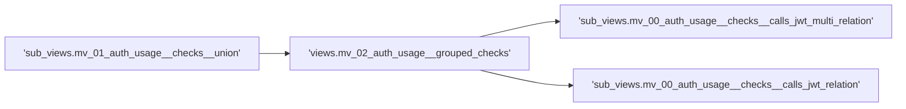

Views defined in this fonder monitor the activity generated by the clients on the authorization server.

In this folder there are different set of views 

> ### TIP
> Due for [Redshift incremental refresh limitation]() lack of support to `outer join` is 
> often used a workaround based on the following technique:
>  - Generate a row for each entity with a column '_usage_' equals to 0
>  - Generate a row for each relation (inner join) with a column '_usage_' equals to 1
>  - Group by '_entity id_' and sum '_usage_' column. 0 in '_usage_' column means record 
>    present in outer join and not in inner join.

# Data Quality
A first set of views give a vision on the "quality": every column in the view 
`views.mv_02_auth_usage__grouped_checks` count, in a given minute, the number 
of violations of a given assertion on the data.
- __token_without_related_call__: count the number of tokens issued in a minute 
  that have `correlation_id` not joined with audit logs.
- __token_issued_without_correlation_id__: count the number of tokens issued in 
  a minute with _null_ `correlation_id`.
- __calls_associated_to_more_than_one_token__: count the number of tokens issued 
  in a minute that are related to two or more calls.

Every of this values must be zero. Any value different from zero means a wrong 
assertion on data or a bug.

Due to [Redshift incremental refresh limitations](https://docs.aws.amazon.com/redshift/latest/dg/materialized-view-refresh.html#materialized-view-refresh-limitations) 
the implementation is split in multiple views and sub_views.

# 
